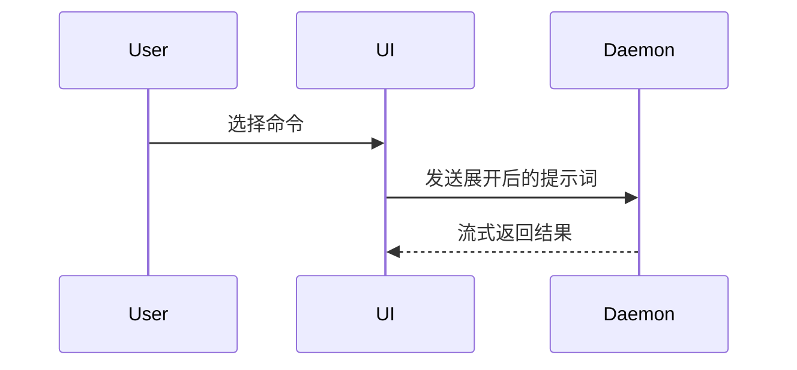

使用以下结构撰写 PR Body：

```markdown
## Summary

<图、diff 草图或树形结构>

## Evidence

- **Before:** <截图、输出或失败的测试>
  **After:** <截图、输出或通过的测试>

## Merge Danger

**Door:** <one-way 或 two-way>

<可选：解释为什么>

**Blast Radius:** <用一个简短词组描述影响范围>

<可选：说明合并可能造成的影响>
```

## 通用要求

- 直接从 `## Summary` 开始，不写前言。
- 保持文字简短；Reviewer 已经能看到 diff，PR Body 的任务是先让人看懂改动的形状、证据和风险。
- 优先使用仓库 `GLOSSARY.md` 中的领域语言；没有该文件时沿用仓库和 issue 中的既有术语。
- 只描述实际 diff、真实测试结果和已知风险，不推测不存在的行为，不把“应该通过”写成“已经通过”。

## Summary

选择能够说明关键变化的最小视图。可以使用一种，也可以组合少量几种；通常不应全部使用。

### 用伪代码展示逻辑或算法

```text
保存内容
  如果内容没有变化
    返回缓存结果
  写入新内容
  返回最新结果
```

### 用调用树展示运行时控制流

```text
submitForm
  createSession
    persistPrompt
    launchAgent
  navigateToSession
```

### 用组件树展示 UI 结构

保留与当前变化有关的状态、模块边界和文件位置：

```text
<SessionPage> (apps/example/src/routes/session.tsx)
  useSessionEvents()
  <SessionToolbar>
    <RunSkillButton> (packages/ui)
```

### 用浅层文件树展示职责变化或大范围重构

```text
src/
├── commands/       # 解析用户操作
├── sessions/       # 管理会话状态
└── transport/      # 发送 API 请求
```

### 用 Mermaid 展示组件交互、控制流或数据流



### 用 diff 草图突出结构变化

当读者已经了解原有结构，而重点是“哪里发生了变化”时使用 `diff`。

组件变化：

```diff
 <SessionPage>
   useSessionEvents()
   <SessionToolbar>
+    <RunSkillButton />
   <SessionTimeline>
+    <SkillResultCard />
```

文件布局变化：

```diff
 src/
 ├── commands/
+│   └── show-me.ts       # 展开斜杠命令
 ├── sessions/
-└── transport.ts
+└── transport/
+    ├── client.ts
+    └── stream.ts
```

调用树变化：

```diff
 submitForm
   createSession
     persistPrompt
+    expandSkillMention
     launchAgent
-  navigateToSession
+  navigateToSession
+    subscribeToEvents
```

状态或控制流变化：

```diff
 保存内容
-  写入内容
+  如果内容没有变化
+    返回缓存结果
+  写入内容
+  使缓存失效
```

### 必要时展示完整目标代码块

当大部分内容都是新增的、缺少上下文会掩盖职责或顺序，或者读者需要可复制的目标形状时，展示完整代码块：

```ts
function expandSkill(command: string): string {
  const skillName = command.slice(1);
  return `use the ${skillName} skill`;
}
```

将每个视图放在它所支撑的简短说明附近。只保留回答当前 PR 核心问题所必需的调用、文件、属性、状态和边界。

## Evidence

提供能够证明变化有效的具体 Before/After 证据。

- UI 变化且环境允许时，优先使用修改前后的截图。
- 非 UI 变化优先使用真实的测试结果、命令输出或行为输出。
- 可以用简短伪代码说明哪条测试修改前失败、修改后通过。
- “测试全部通过”本身只是结论，不是 Before/After 证据；应给出具体命令和结果。
- 如果无法获得 Before 证据，明确说明限制，不要伪造。

## Merge Danger

判断本次修改属于 one-way door 还是 two-way door：

- **two-way door**：可以通过回滚代码较低成本地恢复。
- **one-way door**：包含破坏性或难以逆转的决定，例如不可逆数据迁移、公开 API 删除，或者已经向外部系统发送的数据。

`Blast Radius` 描述修改出错时可能影响的范围，例如：API 消费者、数据一致性、移动端布局、登录用户或部署流程。

不要因为“可以回滚 commit”就自动判定为 two-way door。已经发送的邮件、已经写入的新数据格式或已经执行的外部动作，可能无法随代码回滚而恢复。

## 边界

- 本技能只撰写 PR/MR Body。
- 不执行 `git push`。
- 不调用 `gh pr create` 或 `glab mr create`。
- 不合并 PR/MR。
- 创建 PR/MR 时由 `/create-pr` 负责准备范围、调用本技能并执行平台命令。
